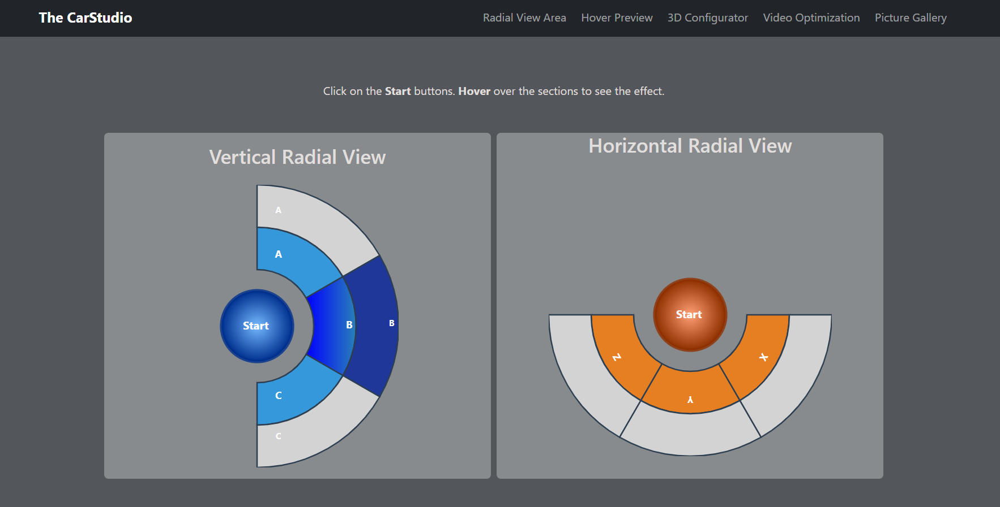
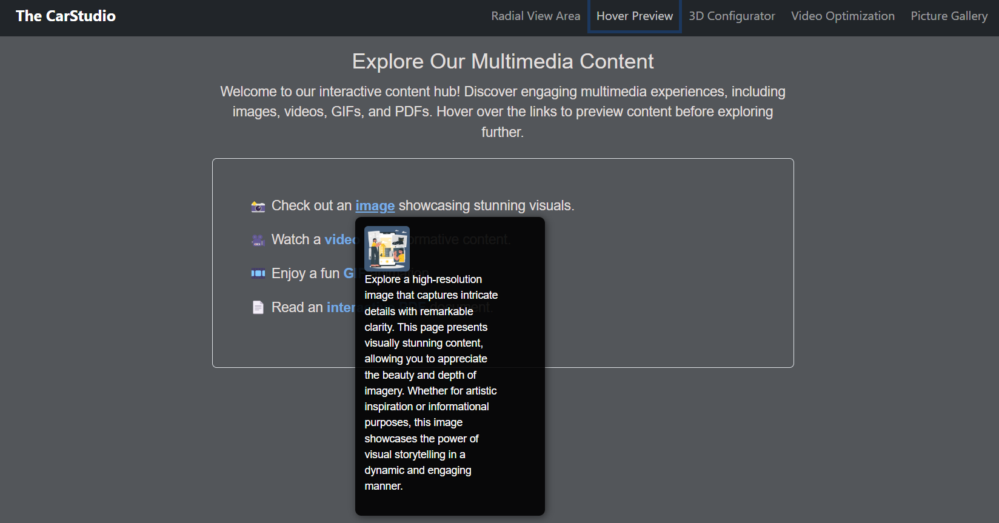
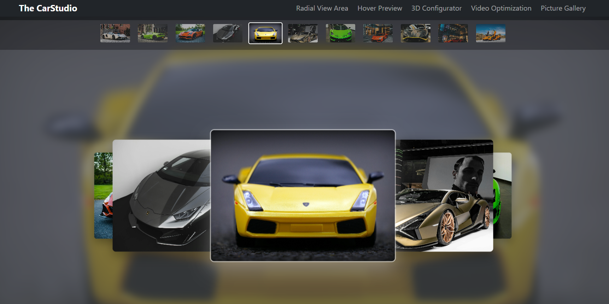

# **The CarStudio**

**The CarStudio** is an interactive web application designed for car enthusiasts, offering a seamless and immersive experience in car customization and exploration. The platform combines cutting-edge 3D rendering, hover previews, and a car picture gallery to deliver a modern and engaging user experience.

[Live Link - The CarStudio](https://the-car-studio.vercel.app/)

---

## **Features**

### 1. **3D Car Customization**
- Customize car colors, wheels, and backgrounds in real-time.
- View the car in a fully interactive 3D environment using `.glb` files.
- Smooth and responsive controls for rotating, zooming, and exploring the car.
- 

### 2. **Hover Previews**
- Preview websites by hovering over links.
- Enhance user experience with quick and interactive previews.
  


### 3. **Car Picture Gallery**
- A visually appealing gallery showcasing high-quality car images.
- Lazy loading for faster performance and optimized loading times.
 

### 4. **Responsive Design**
- Fully responsive layout for seamless use across devices (desktop, tablet, and mobile).

---

## **Technologies Used**
- **React.js**: For building the user interface.
- **Three.js**: For rendering the 3D car models.
- **GLTFLoader**: To load `.glb` files for 3D car customization.
- **CSS/Bootstrap**: For styling and responsive design.
- **React-LazyLoad**: For optimizing image loading in the gallery.
- **React-Intersection-Observer**: For hover previews.

---

## **Installation**

### Prerequisites
- Node.js and npm installed on your system.

### Steps
1. Clone the repository:
   ```bash
   git clone https://github.com/Surbhi-sinha/TheCarStudio.git
   ```
2. Navigate to the project directory:
   ```bash
   cd TheCarStudio
   ```
3. Install dependencies:
   ```bash
   npm install
   ```
4. Start the development server:
   ```bash
   npm start
   ```
5. Open your browser and navigate to:
   ```
   http://localhost:3000
   ```

---

## **Usage**
1. **3D Car Customization**:
   - Navigate to the customization section.
   - Use the controls to change car colors, wheels, and backgrounds.
   - Rotate and zoom to view the car from all angles.

2. **Hover Previews**:
   - Hover over any link to see a live preview of the website.

3. **Car Picture Gallery**:
   - Browse through the gallery to view high-quality car images.
   - Click on an image to view it in full size.

4. **UI-View**;
   - UI representation of the Radial view of car.
---

## **Folder Structure**
```
customcar360/
├── public/          # Static assets (e.g., images, 3D models)
├── src/
│   ├── components/  # React components (e.g., Gallery, Customizer)
│   ├── assets/      # Images, 3D models, and other assets
│   ├── App.js       # Main app component
│   ├── index.js     # Entry point
│   └── styles/      # CSS and styling files
├── package.json     # Project dependencies and scripts
└── README.md        # Project documentation
```

---


Enjoy customizing your dream car with **The CarStudio**! 🚗✨